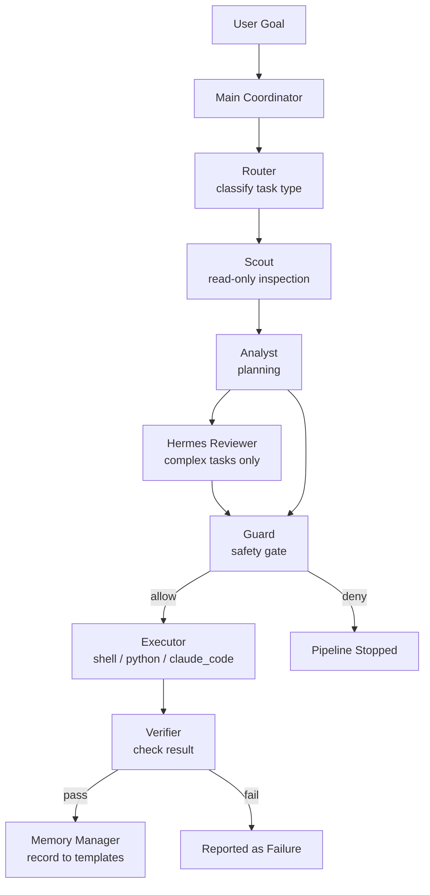

# Multi Agent Lab

[](https://github.com/qian-le/multi-agent-lab/actions/workflows/public-smoke.yml)

A local multi-agent workflow skeleton built around OpenClaw, Hermes, and Claude Code.

## Project Scope

This repository contains a **workflow orchestration framework** for multi-agent collaboration on a single machine. The system routes tasks through specialized agents — Router, Scout, Analyst, Hermes Reviewer, Guard, Executor, Verifier, and Memory Manager — to plan, review, and execute work safely within a sandboxed workspace.

It is designed as a local development and experimentation environment, not a hosted or production system.

## Core Features

- **Router** — classifies incoming goals into workflow types
- **Scout** — read-only inspection of workspace and memory
- **Analyst** — plans approach and sub-steps
- **Hermes Reviewer** — fallback review for complex or ambiguous tasks
- **Guard** — mandatory safety gate before any execution
- **Executor** — runs actions via shell, Python, or Claude Code
- **Verifier** — checks executor output matches intent
- **Memory Manager** — reads/writes structured memory templates
- **Safe workspace boundary** — all writes stay under `.multi-agent/workspace/`

## System Architecture



Text overview:

```
User Goal
  └─> Main Coordinator
       └─> Router (classify task type)
            ├─> Scout (inspect)
            ├─> Analyst (plan)
            ├─> Hermes Reviewer (complex tasks)
            ├─> Guard (safety gate)
            ├─> Executor (run) [only if Guard approves]
            ├─> Verifier (check result)
            └─> Memory Manager (record)
```

## Supported Workflows

| Workflow | Trigger | Stops at |
|---|---|---|
| `info` | file inspection, search, read | never executes |
| `analysis` | evaluation, comparison, planning | never executes |
| `modify` | create/update files in workspace | Guard or Verifier |
| `debug` | diagnose failures | Guard blocks risky ops |
| `architecture` | design review, dry-run | always a plan only |
| `risky` | sudo, system paths, rm -rf | Guard blocks by default |

## Quick Start

```bash
# Detect available runtimes
bash .multi-agent/scripts/detect_tools.sh

# Dry-run an info workflow
bash .multi-agent/scripts/run_workflow.sh --type info --goal "list all agent files"

# Dry-run an architecture review
bash .multi-agent/scripts/run_workflow.sh --type architecture --goal "review current agent roles"

# Run the public smoke test
bash tests/smoke_public.sh
```

## Repository Layout

```
multi-agent-lab/
├── .multi-agent/          # Core skeleton
│   ├── README.md         # Skeleton overview
│   ├── config.yaml        # Workflow routing config
│   ├── agents/           # Agent role definitions
│   ├── adapters/         # Backend adapters (shell, openclaw, hermes, claude_code)
│   ├── workflows/        # Workflow type definitions
│   ├── scripts/          # Runner, verifier, guard check, memory writer
│   ├── memory/
│   │   ├── templates/    # Daily, decision, failure, lesson templates
│   │   ├── project/      # Project status
│   │   └── lessons/      # Cross-task learnings
│   └── workspace/         # Sandbox for executor writes
├── docs/                 # Architecture, security, workflow guides
├── examples/             # Example runs (read-only, no real logs)
├── tests/                # Public smoke test
├── README.md             # This file
├── LICENSE               # MIT
├── CONTRIBUTING.md
├── SECURITY.md
└── ROADMAP.md
```

## Safety Model

The system enforces a **Guard before Executor** policy:

- Guard evaluates all execution requests against a deny-list
- Forbidden: `sudo`, `rm -rf /`, `chmod -R`, `chown -R`, system paths (`/etc`, `/usr`, `/var`, `/opt`)
- Executor writes are **workspace-only** (`.multi-agent/workspace/`)
- No credentials, tokens, keys, or secrets are ever logged
- All memory writes go to structured templates, not raw logs

## Why This Matters

Most agent demos show a single LLM call. This skeleton shows how multiple agents with different responsibilities can collaborate — with a safety gate that actually stops destructive operations, and a verifier that checks whether the executor actually did what was asked.

This is a **workflow skeleton**, not a deployed product. It is useful for studying agent role separation, testing safety boundaries, and running local automation with review steps.

## MiMo Orbit Relevance

This project is designed to integrate **MiMo-V2.5-Pro** as the long-context reasoning engine for several key agent roles. The planned integration targets are:

- **Analyst planning** — multi-step plans with tool call reasoning over long task histories
- **Hermes review** — fallback reasoning review for ambiguous or high-stakes tasks
- **Verifier reasoning** — semantic output verification beyond diff and exit-code checks
- **Memory summarization** — condensing accumulated session records into reusable lessons
- **Workflow optimization** — learning from past Guard decisions to route more efficiently

**Current state:** The skeleton uses rule-based routing and heuristic Guard checks. MiMo-V2.5-Pro integration is a **planned development target**, not a current implementation. The adapter layer is designed to accommodate this integration when the API is available.

See [docs/mimo-orbit.md](docs/mimo-orbit.md) for the full integration plan.

## Roadmap

### Near-term
- Polish public documentation and examples
- Expand smoke tests for all workflow types
- Add more local verifier checks

### Mid-term
- Integrate OpenClaw runtime agent calls (real subprocess routing)
- Improve Claude Code backend adapter
- Improve Hermes non-interactive reviewer mode
- Add richer memory retrieval (semantic vs keyword)

### Long-term
- **MiMo-V2.5-Pro based Analyst** — long-context planner
- **MiMo-V2.5-Pro based Verifier** — semantic output verification
- **MiMo-V2.5-Pro based Hermes Reviewer** — contextual risk reasoning
- Multi-model routing based on task complexity
- Task graph execution with dependency tracking
- Optional web dashboard for workflow monitoring

## License

MIT
